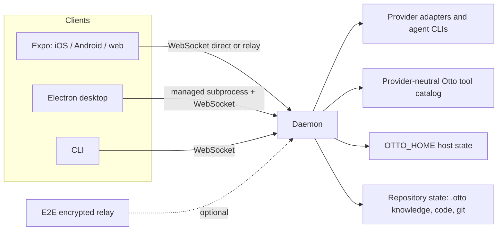

# Architecture

Otto is a local-first client/server system. A Node.js daemon owns agent lifecycles, workspaces, tools, durable host state, and the WebSocket API. Expo, Electron, and CLI clients are projections over that daemon rather than independent implementations.

## Package boundaries

| Package             | Responsibility                                                           |
| ------------------- | ------------------------------------------------------------------------ |
| `packages/server`   | Daemon, agent orchestration, tools, persistence, HTTP/WebSocket services |
| `packages/protocol` | Backward-compatible wire schemas, binary frames, generated validation    |
| `packages/client`   | Shared daemon WebSocket client and SDK facade                            |
| `packages/app`      | Expo UI shared by mobile, web, and desktop renderer                      |
| `packages/desktop`  | Electron host and managed daemon lifecycle                               |
| `packages/cli`      | Terminal client over the same daemon protocol                            |
| `packages/relay`    | Optional end-to-end encrypted remote transport                           |
| `packages/brain`    | Daemon-owned local OpenAI-compatible model host                          |

## Load-bearing boundaries

- Wire changes stay backward-compatible in both directions; see [protocol validation](../../docs/protocol-validation.md) and [RPC namespacing](../../docs/rpc-namespacing.md).
- New capabilities are provider-neutral by contract; see provider-neutral capability parity and [providers](../../docs/providers.md).
- Project knowledge follows [[project-knowledge-is-repository-owned-markdown-managed-atomically-by-otto]].
- Dev, agent, test, demo, and installed daemon lanes use isolated ports and homes; see [development](../../docs/development.md).

The wider canonical architecture is [docs/architecture.md](../../docs/architecture.md).
