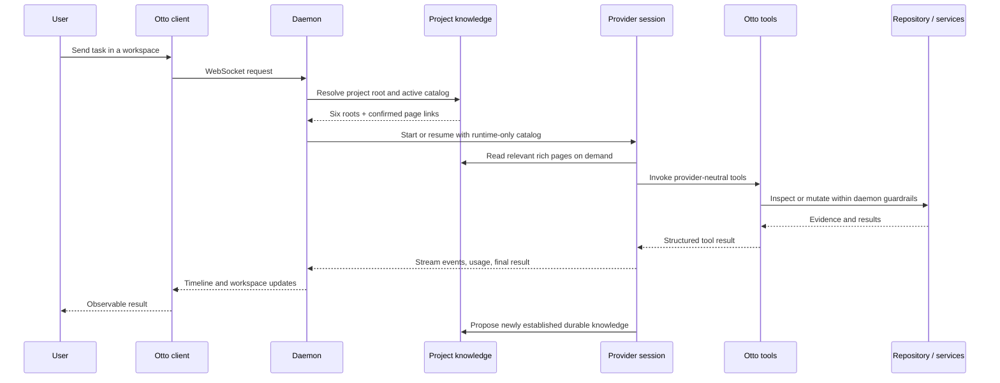

# Flow

## Typical agent task

## Important variants

- Remote clients traverse the optional encrypted relay; daemon semantics stay the same.
- Providers with native Otto tools consume the shared catalog directly. MCP-only providers receive the catalog through the daemon adapter, without a second implementation.
- Preview starts the repository's configured dev server, binds an Otto browser tab, and verifies the rendered result through daemon-enforced browser tools.
- Worktree workspaces resolve shared project knowledge to the repository project root, so branches do not fork project truth.

Sources: [architecture](../../docs/architecture.md), [chat lifecycle](../../docs/chat-lifecycle.md), [providers](../../docs/providers.md), [preview](../../docs/preview.md), and [[project-knowledge-is-repository-owned-markdown-managed-atomically-by-otto]].
