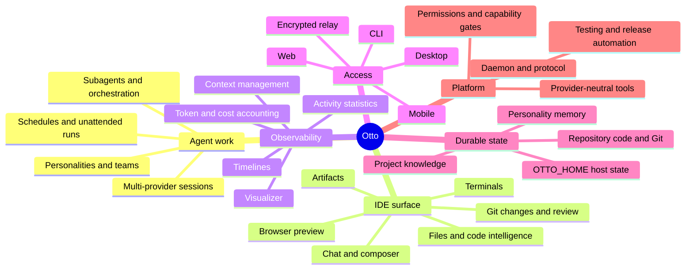

# Mindmap

```mermaid
mindmap
  root((Otto))
    Agent work
      Multi-provider sessions
      Personalities and teams
      Subagents and orchestration
      Schedules and unattended runs
    IDE surface
      Chat and composer
      Files and code intelligence
      Terminals
      Git changes and review
      Browser preview
      Artifacts
    Observability
      Timelines
      Token and cost accounting
      Context management
      Visualizer
      Activity statistics
    Access
      Desktop
      Mobile
      Web
      CLI
      Encrypted relay
    Durable state
      OTTO_HOME host state
      Repository code and Git
      Project knowledge
      Personality memory
    Platform
      Daemon and protocol
      Provider-neutral tools
      Permissions and capability gates
      Testing and release automation
```

The authoritative feature descriptions live in the [documentation index](../../docs/README.md). Project charters and delivery status live in confirmed project Knowledge pages.
