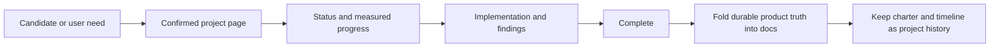

# Roadmap

## Source of truth

Confirmed project pages under this Knowledge store are the authoritative project charters and
delivery ledger. Their review status says whether a charter is trusted; their separate delivery
status and structured progress describe execution. The Projects mode in Manage knowledge reports
counts and completion metrics without maintaining a second registry.

## Strategic direction

1. Preserve provider-neutral capability parity as new frontier-harness capabilities land.
2. Keep agent work observable and reviewable: context, accounting, timelines, Visualizer, browser proof, and durable knowledge.
3. Build reusable agentic coding architectures on the stable IDE-grade platform.
4. Maintain compatibility with upstream where it remains practical, and record deliberate divergence.

## How work moves

Use the active project pages and their delivery metadata for current initiatives, sequencing, and
deferred work. Use reference pages for the external sources that shaped them.
