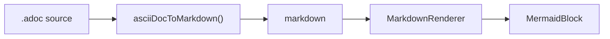
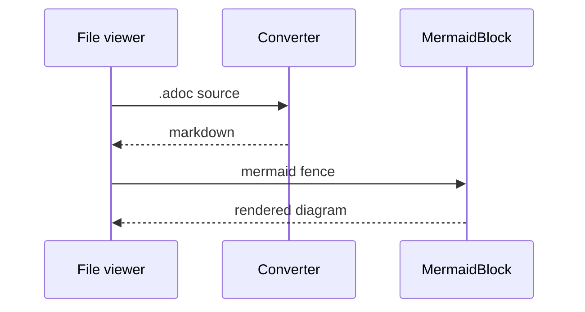
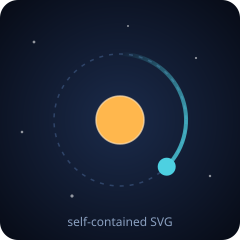

# Markdown Preview Test

The companion to [asciidoc.adoc](asciidoc.adoc). The
two diagrams below are **byte-identical** to the ones in that file — they should
render identically, because both formats funnel into the same `MermaidBlock`.
If they differ, that's the bug.

The YAML frontmatter above appears in the metadata block, the same way the
AsciiDoc file's header attributes do.

> **Note:** Markdown has no admonition syntax, so this is a plain blockquote —
> which is exactly what the AsciiDoc `NOTE:` form converts into.

## Diagrams



A second diagram, to prove more than one renders per document:



## Text formatting

**Bold**, _italic_, `monospace`, and a snake_case_identifier that must stay
intact.

This line ends with an explicit break  
and this text should sit directly underneath it.

Links: [the AsciiDoc site](https://asciidoc.org) and [GitHub](https://github.com).

## Source blocks

```typescript
export function asciiDocToMarkdown(source: string): AsciiDocDocument {
  const lines = source.replace(/\r\n?/g, "\n").split("\n");
  const header = parseDocumentHeader(lines);
  return { frontmatter: formatFrontmatter(header.entries), body: "" };
}
```

An untagged fence:

```
plain, unhighlighted text
```

## Lists

Unordered, nested three deep:

- Top level
  - Second level
    - Third level
- Back to the top

Ordered:

1. First step
2. Second step
   1. A sub-step
3. Third step

## Tables

| Construct | Rendered as |
| --- | --- |
| ` ```mermaid ` | A diagram, via MermaidBlock |
| ` ```typescript ` | A fenced code block with syntax highlighting |
| `> **Note:**` | A blockquote with a bold label |

## Quotes

> A capability isn't done when one provider has it; it's done when they all do.
>
> — Otto CLAUDE.md

## Images

The one place this file reaches for a sibling — `logo.svg` — because resolving a
document's own images against its directory is the thing being tested. Each of
the first three should draw the orbit logo; each of the last three should show
its alt text and never fetch anything.

Same directory, plain: 

Same directory, explicitly relative:


Root-relative, resolved against the workspace root (alt text instead if you
opened `test-documents/` itself as the workspace):


Sized, via the HTML form:

<p align="center">
  
</p>

Escapes the workspace root — must be refused before any read:


Points at a file that isn't there:


Remote, which the viewer never fetches:


---

Everything above this rule should have rendered. Compare against the `.adoc`
file section by section.
