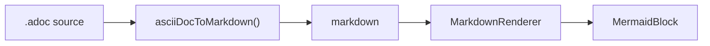
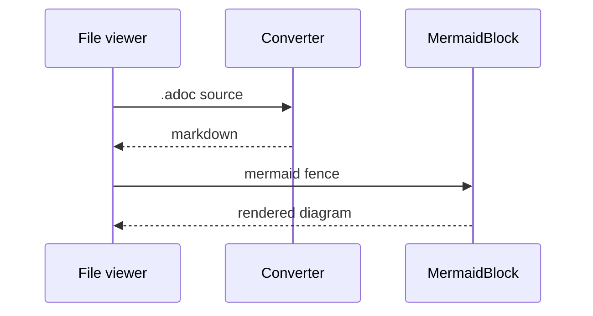

# Markdown Preview Test

The companion to [asciidoc.adoc](asciidoc.adoc). The
two diagrams below are **byte-identical** to the ones in that file — they should
render identically, because both formats funnel into the same `MermaidBlock`.
If they differ, that's the bug.

The YAML frontmatter above appears in the metadata block, the same way the
AsciiDoc file's header attributes do.

> **Note:** Markdown has no admonition syntax, so this is a plain blockquote —
> which is exactly what the AsciiDoc `NOTE:` form converts into.

## Diagrams



A second diagram, to prove more than one renders per document:



## Text formatting

**Bold**, _italic_, `monospace`, and a snake_case_identifier that must stay
intact.

This line ends with an explicit break  
and this text should sit directly underneath it.

Links: [the AsciiDoc site](https://asciidoc.org) and [GitHub](https://github.com).

## Source blocks

```typescript
export function asciiDocToMarkdown(source: string): AsciiDocDocument {
  const lines = source.replace(/\r\n?/g, "\n").split("\n");
  const header = parseDocumentHeader(lines);
  return { frontmatter: formatFrontmatter(header.entries), body: "" };
}
```

An untagged fence:

```
plain, unhighlighted text
```

## Lists

Unordered, nested three deep:

- Top level
  - Second level
    - Third level
- Back to the top

Ordered:

1. First step
2. Second step
   1. A sub-step
3. Third step

## Tables

| Construct | Rendered as |
| --- | --- |
| ` ```mermaid ` | A diagram, via MermaidBlock |
| ` ```typescript ` | A fenced code block with syntax highlighting |
| `> **Note:**` | A blockquote with a bold label |

## Quotes

> A capability isn't done when one provider has it; it's done when they all do.
>
> — Otto CLAUDE.md

## Images

The one place this file reaches for a sibling — `logo.svg` — because resolving a
document's own images against its directory is the thing being tested. Each of
the first three should draw the orbit logo; each of the last three should show
its alt text and never fetch anything.

Same directory, plain: 

Same directory, explicitly relative:


Root-relative, resolved against the workspace root (alt text instead if you
opened `test-documents/` itself as the workspace):


Sized, via the HTML form:

<p align="center">
  
</p>

Escapes the workspace root — must be refused before any read:


Points at a file that isn't there:


Remote, which the viewer never fetches:


---

Everything above this rule should have rendered. Compare against the `.adoc`
file section by section.

## GitHub alerts

Five kinds, each an ordinary blockquote whose first line is the marker. The
marker itself must not appear in the rendering.

> [!NOTE]
> Useful information a reader should notice even when skimming.

> [!TIP]
> An optional shortcut that makes something easier.

> [!IMPORTANT]
> Information a reader needs in order to succeed.

> [!WARNING]
> Something that needs immediate attention because of the risk.

> [!CAUTION]
> A consequence of a risky action.

An ordinary blockquote, for contrast — this one keeps its plain accent:

> Not an alert, just a quote.

A marker that is not one of the five kinds stays literal text:

> [!DANGER]
> Renders with the marker still visible, because GitHub defines five kinds.

Inside a fence the marker is code, never an alert:

```md
> [!NOTE]
> This block must render as source, markers included.
```

## HTML tables

An HTML `<table>` now translates to a GFM table instead of unwrapping to a run
of cell text. `thead`/`tbody` are wrappers and are ignored; the first row is the
header.

<table>
  <thead>
    <tr><th>Format</th><th>Rendered</th><th>Editable</th></tr>
  </thead>
  <tbody>
    <tr><td>Markdown</td><td>yes</td><td>yes</td></tr>
    <tr><td>AsciiDoc</td><td>yes</td><td>source only</td></tr>
  </tbody>
</table>

## Footnotes

A claim needs a source[^src], and so does a second one[^book]. Referencing the
first one again[^src] must reuse its number rather than adding a note.

A reference to something undefined[^nothing] stays exactly as written, because
numbering it would leave a hole in the list below.

[^src]: The source, moved down here from where it was written.
[^book]: A book, numbered second because it was cited second.
[^unused]: Never referenced, so this paragraph stays where it is.

## Task lists

Read-only in chat, tickable in the preview beside the editor.

- [ ] An open item
- [x] A finished item
- A plain item, which has no checkbox at all
  - [ ] A nested open item

1. [ ] An ordered task keeps its number and gains a box

## Math

Inline math sits in a sentence: the identity $e^{i\pi} + 1 = 0$ should render as
a formula, while "it cost $5 and $10 total" must stay as prose.

Underscores and asterisks inside a formula are TeX, not markdown: $a_1 * b_2$.

A display formula gets its own centred line:

$$
\int_0^1 f(x)\,dx = F(1) - F(0)
$$

Math inside a fence stays literal:

```
$x^2$ and $$y^2$$
```
