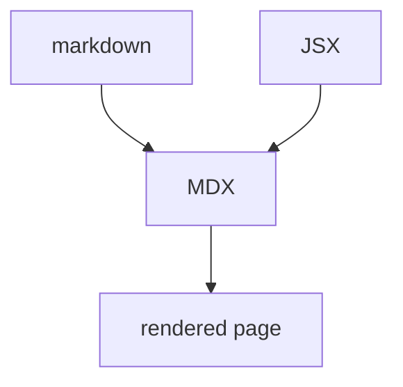

import { Callout } from "./callout";

# MDX Example

MDX is markdown that can hold JSX. Otto highlights it with the **markdown**
parser, so the prose looks like prose and the component syntax shows up as
plain text rather than as rendered components.

<Callout kind="note">
  This block is a component invocation, not markdown. In a real MDX pipeline it
  would render; here it is a syntax-highlighting test.
</Callout>

## Ordinary markdown still works

- Lists behave normally
- **Bold**, _italic_, `code`
- Links: [asciidoc.org](https://asciidoc.org)

export const meta = {
  wordCount: 96,
  lastReviewed: "2026-07-25",
};

## An expression

The answer is {2 + 40}, which MDX would evaluate and markdown would not.
